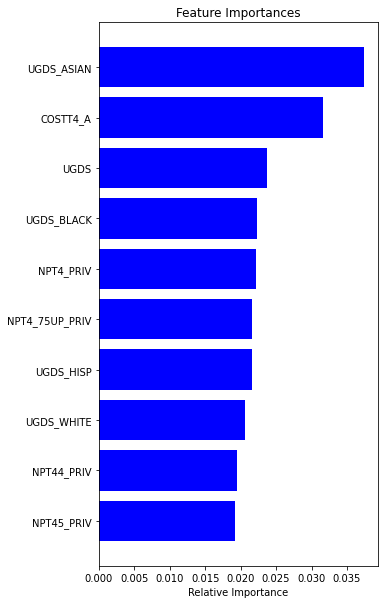

# The Variables to Success

Authors: Che Guan, Judge Hiciano, Nicholas Lee, Tatianna Martinez

**_Abstract -_ This research paper aims to answer two questions: 1. Do students have higher earnings if their degree program was one of the top five degree programs; 2. What top ten features are important in predicting higher earnings for students post graduation? We defined a waterfall data preprocessing and developed an entire analysis process to obtain statistical information on the data. To further test hypotheses, we applied a random forest model to predict high vs low incomes for students’ post graduation 10 years and then selected the most important features. The model was majorly tested with 2019 data, and numerical results show high accuracy and provide reasonable variables to answer the two research questions.**

**_Keywords - decision trees, random forest, IPED, NCES, correlation
matrix_**

# INTRODUCTION

Our group was interested in understanding factors that affect the
success of undergraduate students. Our dataset came from the College
Scorecard site. This site was created for prospective students to
compare the cost and value of higher education in the United States.
This dataset provides information at the institution level for programs
registered with Integrated Postsecondary Education Data system (IPED).
IPED is a system of surveys run annually by the National Center for
Education Statistics (NCES) which is a part of the United States
Department of Education. The information in this dataset varies from
certificate programs to graduate degree programs and has information
from 1996 to 2020.

After exploring the data, the aim of our project was to discover if any
of the top five degree programs are correlated to the student having
higher earnings after graduation using the 2019 school year. We explored
this by using a correlation matrix to determine if there was a high
correlation between the top five degree programs and median earnings.
Upon completion of the correlation matrix analysis, we investigated
which features predicted higher earnings and used a random forest model
to determine the top 10 most important features. We hypothesized that at
least one of the top five degree programs will be correlated with a
student having higher earnings post graduation. As we continued to study
the answer to our question, we realized that we could further our
understanding by using a predictive model. The predictive model would
tell us which features are important for students who had higher
earnings post-graduation.

Research Questions:

1. Do students have higher earnings if their degree program was one of the top five degree programs?

2. What top ten features are important in predicting higher earnings for students post graduation

# DATA SET CLEANING

The complete dataset from College Scorecard included 24 CSV files from
the school years 1996 - 1997 to 2019 - 2020. Each CSV files by school
year (i.e. 2000 - 2001). The year that the academic year ended was used
to create a column “ENDYEAR” for each file. This helped us to track
variable metrics across school years. The files were then vertically
concatenated together to create our initial dataset. We used Tableau
Prep to identify empty columns that were dropped from the dataset. We
dropped all columns with metrics regarding first generation students,
certificate programs, and associate’s degree programs. We kept columns
found in the data dictionary and yaml file that were relevant to our
hypothesis. This included institution variables like name, state, city,
public/private and median earnings six, eight, and ten years post
enrollment. Additionally we looked at the percentage of degrees awarded
because the number of graduates changed based on how long it took them
to complete their program. After pruning the columns in the dataset we
looked to recode the categorical variables.

The documentation showed that many of the categorical columns were coded
numerically as 0, 1, 2. This included variables such as but not limited
to the region, type of degree offered, and religious affiliation. These
variables required us to recode this information using the data
dictionary provided by College Scoreboard to transform them into a human
readable format. For instance, all PCIPxx variables were renamed with
their “LABEL” in the data dictionary to reflect the percentage of the
degree awarded i.e “Business, Management, Marketing, and Related Support
Services”.

After re-coding some values, we continued to narrow down the scope of
the dataset. As mentioned before, we got rid of columns that pertained
to certificates and associate's degrees seeking students specifically
such as CIP01ASSOC. Some columns that had a majority of their values
empty were kept because they pertained to our research questions. It was
advantageous to keep these columns because some were only collected one
year in the dataset, like MD_EARN_WNE_P10 for 2019 was useful for diving
deeper into the data.

One check we did on our dataset was looking to see the percentage of rows that were empty for a given value. We took the count and divided it by the number of rows in the dataset. In the table above are the first 5 rows of this descriptive table sorted by the percentage of rows empty. The top, “RELAFFIL”, is the religious affiliation of the institution and would only be reported if an institution is a private school. Below are two tables that show a snapshot of descriptive statistics for nine columns in the dataset before and after the cleanup process.

During our initial exploration we noticed that the data had a lot of missing values due to privacy. It took a few iterations of cleansing before the data was cleaned in a way that made it easy to analyze the specific features of interests. In our initial exploration the shape of the merged dataset was (170,026, 2990). After removing columns unrelated to our search questions we refined the data set to (48,477, 175). Table 1 & 2 are the descriptive statistics of a few of the columns in the data set before and post the cleanup process. From here we were ready to process the information for exploratory data analysis.

# EXPLORATORY DATA ANALYSIS

With 175 variables, there was still a lot to consider. We used
descriptive statistics using the describe function in pandas on features
of interest. Early on the features that were of interest to our team
early on were admissions rate and race and ethnicity. Our team was
interested in studying racial disparities in education. However, since
the dataset consisted of instances at the school level that deterred us
from looking deeper into these types of metrics.

To continue to refine our dataset, we created a correlation table (Table
4, Appendix) to see if there were any correlations between features in
the dataset. We used this table to further narrow down features that may
be interesting to study. Below are the first 10 rows of the table sorted
by correlation.

Furthermore, we also created a heatmap (Figure 13, Appendix.) to
visualize the correlations between features. This heatmap is for all the
variables in the dataset, 2990, and the columns only show a fraction of
the variables. This graph did give us a few areas of the dataset to
explore further, such as near the diagonal and in the lower right hand
quadrant. These columns are related to the mean earnings 6, 8 and 10
years post enrollment for students no longer at the institution. Since
these are time series variables it appears to make sense that the median
earnings would increase with years of experience (Figure 2). To further
explore this trend we looked at the change year to year in median for
those out of school. In the barchart below we can see fluctuations for
earnings for the years post graduation. The values begin in the 2004
school year, which starts in 2003 and would be when tax information for
students six years post enrollment for the 1996 cohort.

As we studied features we started focusing on the mean earnings
variables within the data set and the features that affect the mean
earnings for student post-graduation. This pushed us to look into the
distribution of degrees awarded across the dataset. This graph is
pictured on the next page.

We then focused on the proportion of percent degrees awarded across all
years in the dataset (Fig. 1). The data is skewed right. This is likely
because colleges offer a variety of degrees for students to pick from
which dilutes the percentages for degrees awarded.. It is rarer to have
an institution at the bachelors level to be focused on certain degrees.
This does occur where \> 20% of a certain degree is awarded in a given
year. These institutions are likely focused on a particular field of
study.

Figure 1. Average Percentage of degree awarded across United States

This graph represents the proportion of degrees awarded across the
entire dataset group. Overarching categories of degrees such as
traditional STEM and social science degrees were not distinguished
because the NCES does not define STEM since there are differences at the
federal level for degree classifications. Figure 1 shows that many of
the degrees are awarded less than ~7% of the time. It is rare to see a
degree awarded greater than 10% of the time. One degree, Business
Management and related services, is consistently above 15% awarded each
year. This is likely from an institution that specializes in business
degrees. is rarer to have an institution award a certain type of degree
more than 20% in a given year. These institutions are generally focused
on such degrees, such as technical colleges focused on one speciality.

Figure 2. Student's income over years

Figure 3. Top five programs over years

We saw that the percentage of degrees awarded for Health Professions and
Related Programs have been increasing since 2006. There was also a drop
in the percentage of degrees awarded for Business Management, Marketing
and Related Support Services between 2011 and 2015. There is also a
decrease in the percentage of degrees awarded for Education. After
looking at the spread of degrees we decided that we wanted to answer one
question: for data collected in 2019, if the degree awarded is from the
top five degree programs across all years does that mean the student has
potential to earn a higher income?

Figure 4. Rank of degree by median of percentage enrolled

For the 2019 dataset, we filtered on \`ENDYEAR\` being equal to 2019,
and dropped all other columns outside of what we determined was needed
to answer our question which left us with 45 that includes the degree
programs, the number of students enrolled, and institution ID, and the
state of the institution. We first looked at the data as whole or on a
national level. When we ranked the programs based on the percentage of
the student body enrolled into the given program we see the results of
the top 5 programs in Table 5.

Figure 5.Correlation Matrix for all the features related to enrollment
count and program participation

Using a correlation matrix on the dataset as a whole, there was no
strong positive or negative correlation between the median wage and any
of the programs or enrollment counts at the national level. We decided
to break it down further into just the top five programs and check the
correlation with just the programs and the mean wage. We can see in
Figure 6 that the strongest correlation is still considered weak at .15.
Next we decided to group the data on the state of the institution and
see if this changed any of the results.

Figure 6. Correlation Matrix For Top 5 Programs Based On Percentage
Enrolled

Figure 7. Correlation Matrix for Data Set Grouped by State

Table 6.

|           |                                                                                  |                                                                                  |
| --------- | -------------------------------------------------------------------------------- | -------------------------------------------------------------------------------- |
| **Order** | **Top five degree programs for 2019:**                                           | **Grouped Top five degree programs for 2019:**                                   |
| 1         | Business, Management, Marketing, and Related Support Services                    | Business, Management, Marketing, and Related Support Services                    |
| 2         | Health Professions and Related Programs                                          | Health Professions and Related Programs                                          |
| 3         | Computer and Information Sciences and Support Services                           | Theology And Religious Vocations.                                                |
| 4         | Homeland Security, Law Enforcement, Firefighting and Related Protective Services | Computer and Information Sciences and Support Services                           |
| 5         | Psychology                                                                       | Homeland Security, Law Enforcement, Firefighting and Related Protective Services |

From Figure 7 above we can see that grouping by state changes the
results and there is strong correlation among many of the programs and
the mean income as shown in Figure 7. Grouping by state also changes the
results of the top 5 programs as seen in Table 6. Based on these
findings we see that our data is sensitive to locality.

Figure 8. Correlation Matrix for top 5 program

Grouping by state drastically changes the original finding of no
correlation to now having very strong correlations across all the
programs, especially with programs ranked 1 and 4 from Table 6 from the
grouped column. This insight showed that while at a national level there
is very little correlation between the program entered and the median
income, there is correlation once you start to group the data by
locality.

# ASSUMPTIONS AND LIMITATIONS

The data collected over the years by College Scoreboard has changed over
time. Variables are not always present in previous years such as Some of
the variables are not present year to year (MD_EARN_WNE_P10) was only
included in 2019, while others are more consistent, such as institution
name. This provides challenges in cleaning the dataset. Others were
masked with “PrivacySuppressed” which has reduced the number of data
points we can use for columns.

For our analysis we decided to look at predominantly bachelor degree
granting institutions. This meant that some data would be lost from the
predominantly associate degree institutions that do award bachelor
degrees but the majority of degrees awarded may be associates or
graduate degrees.. As we cleaned the data we realized there was not
enough information to investigate first generation students because of
lack of data (information related to percentage of missing data was \>
70%). Graduation rates were not looked at due to differences in how the
data was collected, missing data, and varying times students could
graduate. For example, variables were collected for the time it took to
graduate for a student. This could be 100%, 150%, 200% of the time the
program normally takes. Approach is to breakdown the data set by various
populations and then decide whether we would like to proceed with
building a model. Cost data doesn't have enough data for us to look at
the cost of the institution.

A limitation of this data was the reliance on schools to provide the
information each year. Over the course of the dataset from 1996 - 2020,
there were X percentage of schools that are no longer in operation.
Other institutions like “Saint Luke's College of Health Sciences” only
award healthcare degrees

# PREDICTIVE MODELING

To further address the question on what ten features are important in
predicting higher earnings for students’ post-graduation, the models of
decision trees and random forest were separately applied to predict high
vs low incomes for students’ post-graduation 10 years, and then the most
important features are selected. The details are explained as follows.

In this modeling, the MD_EARN_WNE_P10 (median earnings of students
working and not enrolled 10 years after entry) is chosen as the
dependent variable. Since it is continuous, to simplify the complexity
of the forecasting task, a simply logic is applied to convert the target
from continuous to binary

> o 1 (meaning high income), if MD_EARN_WNE_P10\> the average
>
> o 0 (meaning low income), else

The independent variables to both models include categorical and
continuous variables:

- Categorical variables:

1.  Bachelor's degree in various subjects (38 subjects in total)

2.  Region

3.  Type of school

4.  Degrees offered at different levels

5.  City

6.  State

- Continuous variables:

7.  Admission rate

8.  Average cost of attendance

9.  Average net price for different levels of family income (9 family
    income buckets intotal)

10. Number of school branches

11. Percentage of degrees awarded in different subjects (38 subjects in
    total)

12. Total share of enrollment of undergraduate degree-seeking students
    with different races (11 races in total)

To further impute the missing values and transform features, the
following steps are applied to categorical and continuous variables
separately:

- Feature engineering for categorical variables:

  - Group school level data by regions and impute missing values with
    the mode

  - Convert each categorical variable into dummy

- Feature engineering for continuous variables:

  - Group data by school and year, and impute missing with the mean

  - Convert continuous variable (e.g., admission rate) into the
    categorical variable by creating ten bins

To predict the target (high income vs low income), the models of
decision trees and random forest are applied separately. A decision tree
is a supervised learning algorithm used for both classification and
regression problems. It builds the model in the form of a tree structure
with decision nodes and leaf nodes. A decision node consists of two or
more branches. Leaf node represents a decision. There are metrics used
to train decision trees. One of them is entropy. Entropy measures the
impurity or uncertainty in a group of observations, and it can determine
how a decision tree chooses to split data. A tree that is too large
risks overfitting the training data and poorly generalizing to new
samples. Pruning can reduce the size of a learning tree without reducing
predictive accuracy as measured by a cross-validation set.

Pruning tries to fix a bad model and can be expensive. We can build a
better model using the Ensemble method. Bagging is an ensemble algorithm
that fits multiple models on different subsets of a training dataset,
then combines the predictions from all models. Random forest is an
extension of bagging that also randomly selects subsets of features used
in each data sample. Steps involved in random forest algorithm:

Step 1: N number of random records are taken from the data set having K
number of records.

Step 2: Individual decision trees are constructed for each sample.

Step 3: Each decision tree will generate an output.

Step 4: Final output is considered based on Majority Voting or Averaging
for Classification and regression respectively.

Generally, decision trees are useful when one needs an interpretable
result (can be shown and explained easily). Random forests consist of
multiple single trees each based on a random sample of the training
data. They are typically more accurate than single decision trees, but
it is not as comprehensible as decision trees.

# NUMERICAL TESTING RESULTS

In the following experiments, both decision trees and random forest are
tested with 2019 data as MD_EARN_WNE_P10 is majorly available in this
year. Data are split into training (55%), validation (20%) and test
(25%) sets. Training and validation sets are used to tune up models
which are finally tested with the reserved test set.

As shown in the classification reports in Figure 9, the accuracy
performance from validation periods is 100% for both models, whereas the
accuracy is 78% from decision trees and 86% accuracy from random forest.
This indicates the overfitting issues exist in both models, but random
forest is able to mitigate the overfitting effect by 8% in comparison to
decision trees.

Figure 9. Classification reports for decision trees (left) and random
forest (right)

To further evaluate both models, confusion matrices are compared in
Figure 10. It is observed that the random forests significantly increase
the true positive value to 248 in comparison to 210 from decision trees,
and significantly decrease the false negative to 5 in comparison to 43
from decision trees. Finally, the important features from both models
are displayed in Figure 11 and summarized as follows:

- Average cost of attendance

- Enrollment of degree-seeking students and diversity of students

- Average net price of family income

- Degree programs

- Type of school

Figure 10. Confusion matrices from decision trees (left) and random
forest (right)

Figure 11. Top 10 selected features from decision trees (left) and
random forest (right)

# CONCLUSION

From this analysis on the College Scorecard dataset from years 1997 -
2020 confined to the institutions that predominantly award bachelor
degrees the key features that contribute to a higher than average
earnings 10 years post graduation include: average cost of attendance,
diversity of students, average net price of family income, degree
programs, type of school. These features are suggested from nonlinear
models, indicating the relationship between a feature and target could
be nonlinear or even complicated. From the model performance
perspective, random forests are more accurate than single decision
trees.

# REFERENCES

U.S Department of Education (2020). College Scorecard Institution-Level
Data \[Data Files\]. Available from College Scorecard
https://collegescorecard.ed.gov/data/

# APPENDIX

# Table 1.

|                        |       |        |                |      |          |          |          |          |          |          |           |               |
| ---------------------- | ----- | ------ | -------------- | ---- | -------- | -------- | -------- | -------- | -------- | -------- | --------- | ------------- |
| Variable               | count | unique | top            | freq | mean     | std      | min      | 25%      | 50%      | 75%      | max       | percent_empty |
| RELAFFIL               | 733   | 57     | Roman Catholic | 199  | NaN      | NaN      | NaN      | NaN      | NaN      | NaN      | NaN       | 0.985         |
| MD_EARN_WNE_INDEP1_P10 | 1600  | NaN    | NaN            | NaN  | 49128.37 | 14359.89 | 17297.00 | 39760.00 | 46970.00 | 55533.50 | 125815.00 | 0.97          |
| MD_EARN_WNE_INDEP1_P8  | 1629  | NaN    | NaN            | NaN  | 45993.88 | 13608.67 | 17187.00 | 37136.00 | 44269.00 | 52578.00 | 124841.00 | 0.97          |
| MD_EARN_WNE_INDEP1_P6  | 1665  | NaN    | NaN            | NaN  | 43188.10 | 13283.70 | 14213.00 | 34445.00 | 41456.00 | 49494.00 | 124183.00 | 0.97          |
| MD_EARN_WNE_INC3_P10   | 1696  | NaN    | NaN            | NaN  | 57055.47 | 14061.22 | 25082.00 | 48042.00 | 54236.00 | 64245.25 | 125001.00 | 0.97          |

#

Table 2.

|                        |              |            |                |              |                |                |               |                |               |
| ---------------------- | ------------ | ---------- | -------------- | ------------ | -------------- | -------------- | ------------- | -------------- | ------------- |
| BEFORE DATASET CLEANUP |              |            |                |              |                |                |               |                |               |
|                        | **ADM_RATE** | **UGDS**   | **UGDS_WOMEN** | **UGDS_MEN** | **UGDS_WHITE** | **UGDS_BLACK** | **UGDS_HISP** | **UGDS_ASIAN** | **UGDS_AIAN** |
| **count**              | 46,901.00    | 150,618.00 | 150,582.00     | 150,582.00   | 80,240.00      | 80,240.00      | 80,240.00     | 80,240.00      | 80,240.00     |
| **mean**               | 0.69         | 2,204.51   | 0.65           | 0.35         | 0.46           | 0.17           | 0.15          | 0.03           | 0.01          |
| **std**                | 0.22         | 4,971.20   | 0.24           | 0.24         | 0.32           | 0.22           | 0.22          | 0.07           | 0.07          |
| **min**                | 0.00         | 0.00       | 0.00           | 0.00         | 0.00           | 0.00           | 0.00          | 0.00           | 0.00          |
| **25%**                | 0.56         | 111.00     | 0.53           | 0.14         | 0.15           | 0.02           | 0.01          | 0.00           | 0.00          |
| **50%**                | 0.72         | 457.50     | 0.63           | 0.36         | 0.50           | 0.08           | 0.06          | 0.01           | 0.00          |
| **75%**                | 0.86         | 1,970.00   | 0.86           | 0.47         | 0.73           | 0.22           | 0.17          | 0.03           | 0.01          |
| **max**                | 1.00         | 253,594.00 | 1.00           | 1.00         | 1.00           | 1.00           | 1.00          | 1.00           | 1.00          |

Table 3.

|                          |              |            |                |              |                |                |               |                |               |
| ------------------------ | ------------ | ---------- | -------------- | ------------ | -------------- | -------------- | ------------- | -------------- | ------------- |
| **POST DATASET CLEANUP** |              |            |                |              |                |                |               |                |               |
|                          | **ADM_RATE** | **UGDS**   | **UGDS_WOMEN** | **UGDS_MEN** | **UGDS_WHITE** | **UGDS_BLACK** | **UGDS_HISP** | **UGDS_ASIAN** | **UGDS_AIAN** |
| **count**                | 31,141.00    | 46,435.00  | 46,435.00      | 46,435.00    | 25,238.00      | 25,238.00      | 25,238.00     | 25,238.00      | 25,238.00     |
| **mean**                 | 0.67         | 3,990.59   | 0.56           | 0.44         | 0.49           | 0.13           | 0.10          | 0.04           | 0.01          |
| **std**                  | 0.20         | 6,513.25   | 0.18           | 0.18         | 0.31           | 0.19           | 0.17          | 0.06           | 0.03          |
| **min**                  | 0.00         | 0.00       | 0.00           | 0.00         | 0.00           | 0.00           | 0.00          | 0.00           | 0.00          |
| **25%**                  | 0.55         | 662.00     | 0.50           | 0.37         | 0.22           | 0.02           | 0.02          | 0.00           | 0.00          |
| **50%**                  | 0.70         | 1,656.00   | 0.57           | 0.43         | 0.58           | 0.06           | 0.05          | 0.01           | 0.00          |
| **75%**                  | 0.81         | 4,262.00   | 0.63           | 0.50         | 0.75           | 0.14           | 0.11          | 0.04           | 0.01          |
| **max**                  | 1.00         | 241,832.00 | 1.00           | 1.00         | 1.00           | 1.00           | 1.00          | 1.00           | 1.00          |

Table 4.

|            |                |                 |                                                                                                       |                                                                                                       |
| ---------- | -------------- | --------------- | ----------------------------------------------------------------------------------------------------- | ----------------------------------------------------------------------------------------------------- |
| **var1**   | **var2**       | **Correlation** | **var1_description**                                                                                  | **var2_description**                                                                                  |
| NPT41_PUB  | NPT4_048_PUB   | 0.99            | Average net price for \$0-\$30,000 family income (public institutions)                                | Average net price for \$0-\$48,000 family income (public institutions)                                |
| NPT41_PRIV | NPT4_048_PRIV  | 0.99            | Average net price for \$0-\$30,000 family income (private for-profit and nonprofit institutions)      | Average net price for \$0-\$48,000 family income (private for-profit and nonprofit institutions)      |
| NPT43_PRIV | NPT4_3075_PRIV | 0.98            | Average net price for \$48,001-\$75,000 family income (private for-profit and nonprofit institutions) | Average net price for \$30,001-\$75,000 family income (private for-profit and nonprofit institutions) |
| NPT45_PUB  | NPT4_75UP_PUB  | 0.98            | Average net price for \$110,000+ family income (public institutions)                                  | Average net price for \$75,000+ family income (public institutions)                                   |
| NPT44_PUB  | NPT4_75UP_PUB  | 0.98            | Average net price for \$75,001-\$110,000 family income (public institutions)                          | Average net price for \$75,000+ family income (public institutions)                                   |
| NPT45_PRIV | NPT4_75UP_PRIV | 0.98            | Average net price for \$110,000+ family income (private for-profit and nonprofit institutions)        | Average net price for \$75,000+ family income (private for-profit and nonprofit institutions)         |
| NPT43_PUB  | NPT4_3075_PUB  | 0.98            | Average net price for \$48,001-\$75,000 family income (public institutions)                           | Average net price for \$30,001-\$75,000 family income (public institutions)                           |
| NPT42_PRIV | NPT4_3075_PRIV | 0.98            | Average net price for \$30,001-\$48,000 family income (private for-profit and nonprofit institutions) | Average net price for \$30,001-\$75,000 family income (private for-profit and nonprofit institutions) |
| NPT42_PUB  | NPT4_048_PUB   | 0.98            | Average net price for \$30,001-\$48,000 family income (public institutions)                           | Average net price for \$0-\$48,000 family income (public institutions)                                |
| ADM_RATE   | ADM_RATE_ALL   | 0.98            | Admission rate                                                                                        | Admission rate for all campuses rolled up to the 6-digit OPE ID                                       |

Table 5.

|           |                                                               |                                                                                  |
| --------- | ------------------------------------------------------------- | -------------------------------------------------------------------------------- |
| **Order** | **Top five degree programs across all years:**                | **Top five degree programs for 2019:**                                           |
| 1         | Business, Management, Marketing, and Related Support Services | Business, Management, Marketing, and Related Support Services                    |
| 2         | Health Professions and Related Programs                       | Health Professions and Related Programs                                          |
| 3         | Visual and Performing Arts                                    | Computer and Information Sciences and Support Services                           |
| 4         | Psychology                                                    | Homeland Security, Law Enforcement, Firefighting and Related Protective Services |
| 5         | Biological and Biomedical Science                             | Psychology                                                                       |

Figure 12. Median earnings of students

Figure 13. Heatmap that visualizes correlation between features

Figure 14. Idea of Random Forest (Source: IDSS)
